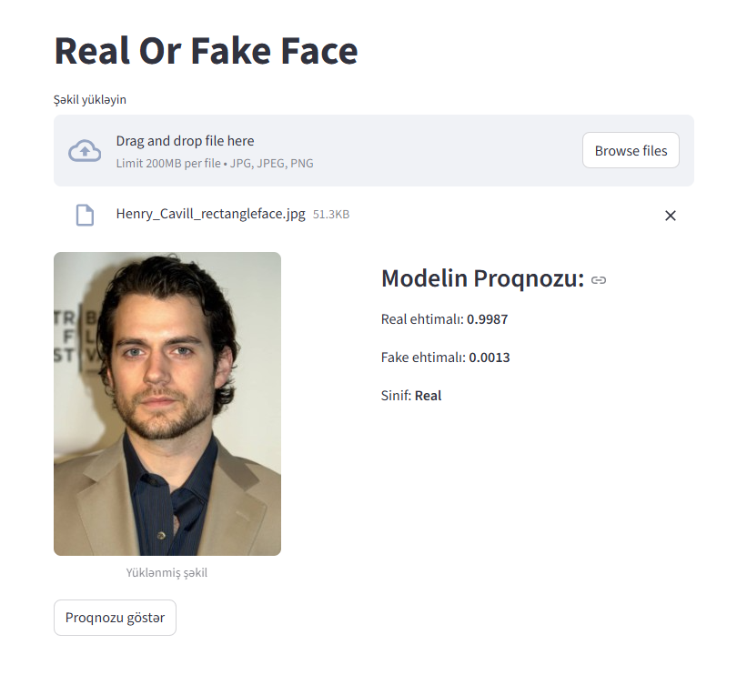
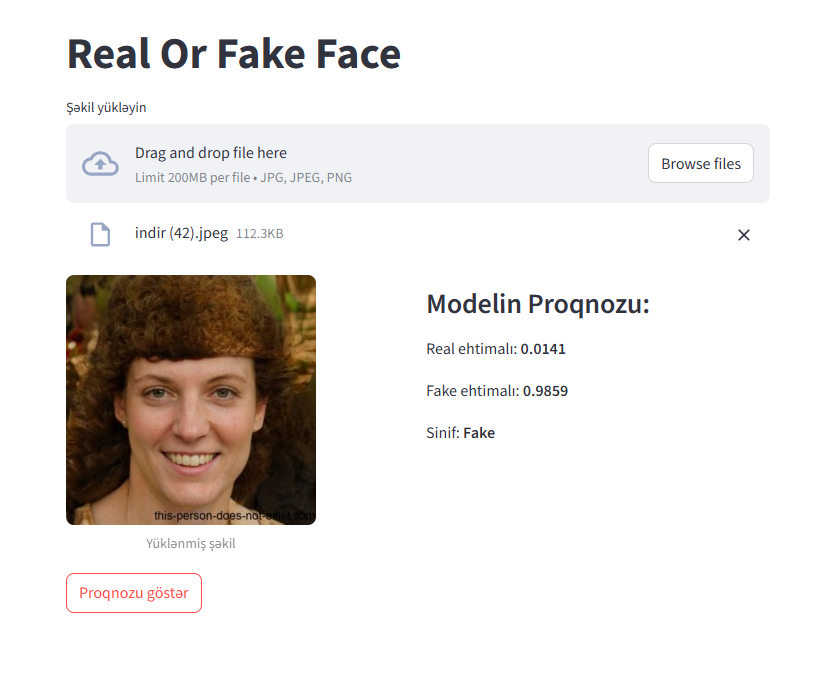

# FakeOrRealFace — Detect Whether a Face Image is Real or Fake
This project classifies human face images as **real** or **fake** using a convolutional neural network (CNN) trained with TensorFlow/Keras.  
A simple **Streamlit** interface allows local predictions through an easy-to-use UI.

## ⚠️ Note on Model File
The trained model file is quite large and cannot be uploaded directly to this GitHub repository due to size limitations.
If you want to download the trained model weights, you can get them here:  
[Download model weights (Google Drive)](https://drive.google.com/file/d/1HgMOaApCpwK23BYISxEKoiPEMVLL07K1/view?usp=sharing)

## Model Architecture
The classification model is built **from scratch**, meaning the DenseNet-50 architecture was implemented manually in code without using pretrained weights or ready-made models.  
This custom implementation allows full control over the network design and training process.
The model was trained on a balanced dataset of real and fake faces to accurately classify images.

## Dataset and Model
This project uses the dataset [140k Real and Fake Faces](https://www.kaggle.com/datasets/xhlulu/140k-real-and-fake-faces) from Kaggle, which contains:
- **70,000 real face images** collected from the Flickr dataset by Nvidia.
- **70,000 fake face images** generated by StyleGAN (a GAN-based AI model), provided by Bojan.
The dataset provides a balanced mix of real and AI-generated faces for training and evaluation.

**In the Streamlit app, I uploaded a real face image, and the model correctly predicted it as real.**

**In the Streamlit app, I uploaded a fake face image, and the model correctly predicted it as fake.**


## Installation
1.Clone the repository:
```
git clone https://github.com/velish-qubadov/FakeOrRealFace.git
cd FakeOrRealFace
```
2.(Optional) Create and activate a virtual environment:

Windows:
```
python -m venv venv
venv\Scripts\activate
```
macOS / Linux
```
python3 -m venv venv
source venv/bin/activate
```
3.Install dependencies:
```
pip install -r requirements.txt
```
4.Run the Streamlit app:
```
streamlit run app.py
```
